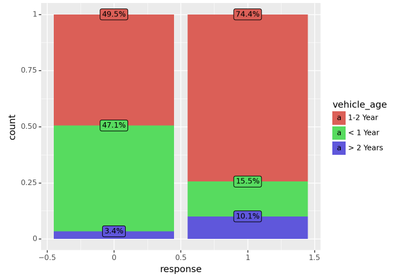
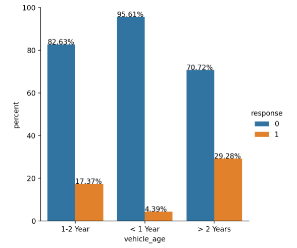
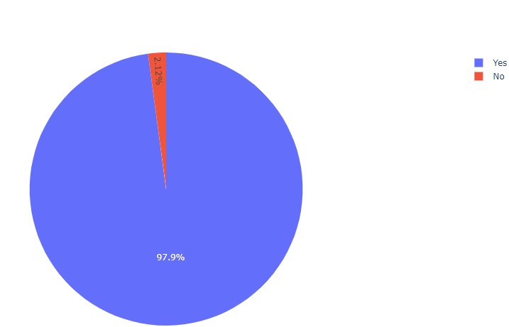
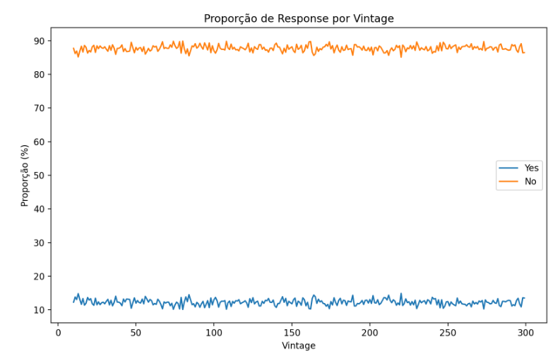
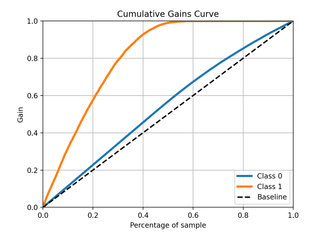
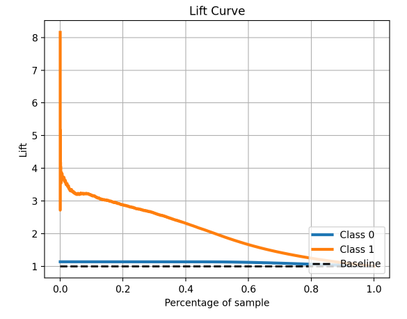
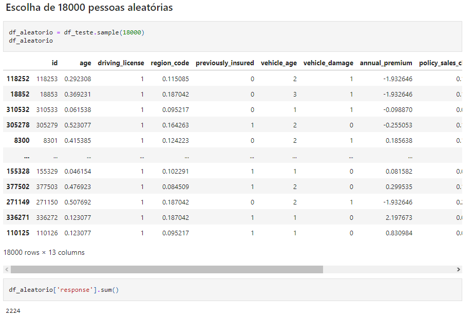
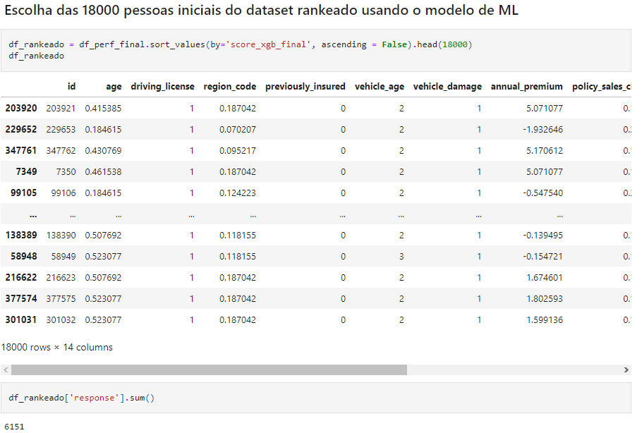
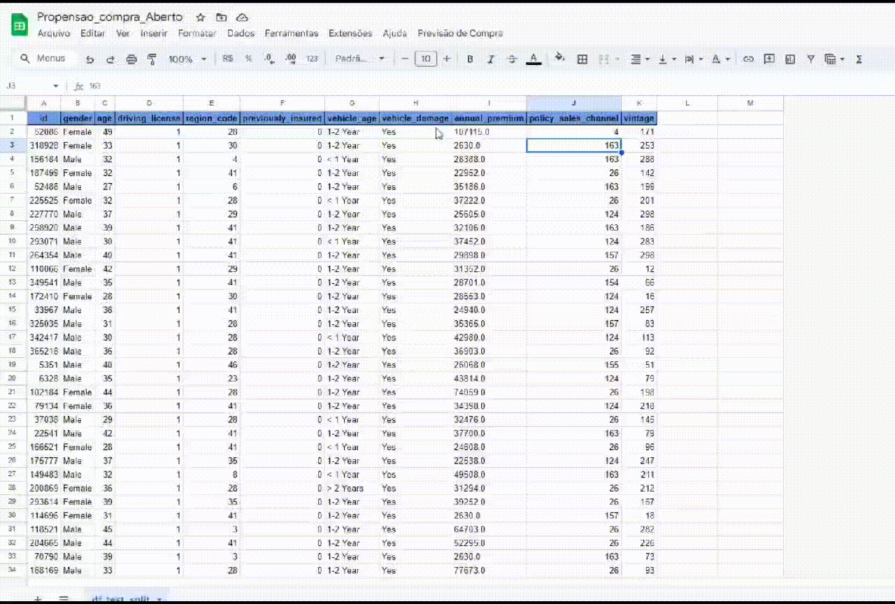

# Previsão de Cross-Sell - Seguros

 
Projeto de ranqueamento de clientes interessados na aquisição de um seguro veicular.

O Dataset foi obtido no [Kaggle](https://www.kaggle.com/datasets/anmolkumar/health-insurance-cross-sell-prediction)

## 1. PROBLEMA DE NEGÓCIO 
### 1.1 Problema
A Starfield Seguros é uma empresa de seguros bem consolidada no ramo de seguros relacionados a saúde.
Como uma forma de expandir seus negócios a empresa irá apostar em uma estratégia de Cross Sell, ela irá ofertar aos seus clientes um novo produto, um seguro veicular.

Desta forma foi realizada uma pesquisa com uma parte da base de clientes para entender o perfil que busca esse tipo de produto. Mas devido ao call center já estar bastante atarefado, ele possui uma capacidade de limitada de contatar clientes potenciais.

Logo, a fim de otimizar a conversão e o faturamento da empresa nessa nova estratégia, será necessário que a lista de possíveis clientes seja ordenada de forma que os clientes mais propensos a comprar o novo produto sejam os primeiros a serem contatados.

### 1.2 Objetivo
A partir dos dados de pesquisa realizada pela empresa, construir um ranking por ordem de interesse (propensão de compra) dos potenciais clientes.

## 2. Premissas de negócio
- O time de vendas já utiliza o Google Sheets como ferramenta corporativa. É preciso que o ranking de propensão de compra seja incorporado nele.

## 3. Planejamento da solução
### 3.1. Produto final
O que será entregue efetivamente?
- Uma funcionalidade dentro da ferramenta Google Sheets, que ordena os clientes por propensão de compra.

### 3.2. Ferramentas
Quais ferramentas serão usadas no processo?
- Python;
- Jupyter Notebook;
- Git e Github;
- Render Cloud;
- Seaborn, Pyplot, Plotnine e Scikitplot 
- Algoritmos de Classificação;
- Pacotes de Machine Learning sklearn e xgboost;
- Técnicas de Seleção de Features;
- Técnicas de Encoders e Reescaling
- Flask e Python API's;
- Google Sheets Apps Script.

### 3.3 Processo
#### 3.3.1 Estratégia de solução

A estratégia de solução adotada neste projeto se baseia no método CRISP-DS (*Cross Industry Standard Process for Data Science*), uma adaptação do CRISP-DM (*Cross Industry Standard Process for Data Mining*). 
A ideia por trás desse método é passar de forma cíclica pelas várias fases, dessa forma é possível mapear os principais problemas do projeto e entregar valor ao negócio de forma rápida. Com o fim da primeira entrega podemos fazer uma nova iteração, fazendo ajustes necessários em todas as fases.

#### 3.3.1.1 Business Problem:

Com base no objetivo do projeto, trata-se portanto de um problema de Learning to Rank (LTR). Onde precisaremos ordenar os clientes com base em um score de propensão de compra.

#### 3.3.1.2 Business Understanding:

O projeto se baseia em uma necessidade do negócio de realizar a estratégia de cross sell para ampliar o faturamento.

Cross sell, ou venda cruzada, é uma estratégia muito utilizada atualmente, onde a empresa oferece outro produto ou serviço complementar ao cliente, para melhorar a experiência do cliente.
Um exemplo de cross sell é se você compra um tênis para praticar um esporte, o vendedor pode lhe oferecer meias os acessórios para aquele esporte em específico.

#### 3.3.1.3 Data Extraction:

Neste cenário fictício, nossa fonte de dados é um arquivo .csv de uma competição do Kaggle, mas poderia ser do banco de dados da empresa, um conjunto de planilhas dentre outras fontes.

#### 3.3.1.4 Data Cleaning:
Após a coleta dos dados iniciou-se a etapa de limpeza dos dados. Essa etapa abrangeu alguns tópicos como:

- **_Descrição dos dados_**. Foram renomeadas as colunas, checadas os tipos das variáveis disponíveis no conjunto de dados e transformados para os tipos mais convenientes. Além de realizar o uso de estatística descritiva para obter mais informações sobre os dados a serem usados. 

- **_Verificação dos valores nulos_**: Nesta etapa, foram verificados se existiam dados nulos, porém nenhum foi encontrado. 

- **_Separação dos dados_**: Foram separados 20% dos dados para teste de forma aleatória e estratificados pela variável resposta.

#### 3.3.1.5 EDA - Exploratory Data Analysis:
Essa se trata da fase mais longa do ciclo, onde foram realizadas análises uni variadas, bivariadas e multivariada.

Durante a análise bivariada, visando entender como as variáveis impactam o fenômeno de vendas e qual a intensidade desse impacto, criadas várias hipóteses e algumas foram selecionadas para serem ou não validadas.

Abaixo iremos detalhar 3 das hipóteses que trouxeram insights valiosos para o negócio.

**_Os 3 principais insights dos dados_**

##### Hipótese 2: Clientes com carros mais velhos são menos propensos a comprar um seguro.

**FALSO:** Em números totais, apenas 10,1% das pessoas com carros com idade maior que 2 anos se mostraram interessadas no seguro, porém relativo à quantidade de amostras foi a que obteve maior número de interessados, 29,28% das pessoas com carros mais velhos que 2 anos disseram sim, contra 17,37% de pessoas com carros de 1 a 2 anos e 4,39% das pessoas com carros com até 1 ano. Porém, um adendo é que o número de pessoas na base com carros maior que dois anos é muito inferior as outras duas categorias. 
Para validar completamente essa hipótese precisaríamos de mais amostras de clientes com carros mais velhos que 2 anos.

##### Hipótese 3: Clientes que tiveram o carro danificado no passado são mais propensos a comprar um seguro.

**VERDADEIRO:** 97.9% das pessoas que aceitam o seguro o carro já havia sido danificado anteriormente.

##### Hipótese 5: Pessoas que possuem um maior tempo como cliente, são mais propensos a adquirir um seguro veicular.

**FALSO:** Não há quaisquer relações observável entre o tempo como cliente e a proporção entre estar interessada no seguro ou não.

#### 3.3.1.6 Modeling:

Uma vez que o aprendizado dos algoritmos de machine learning é facilitado com dados numéricos que estejam na mesma escala, foram aplicadas técnicas de **Standardization**, **Rescaling** e **Encoding** e a fim de preparar os dados para o treinamento do modelo de machine learning.

Essas transformações também foram aplicadas aos dados de teste.

- **_Seleção de features_**:

Nessa etapa excluímos as colunas usadas para a derivação de outras variáveis e foi utilizado o algoritmo Random Forest para identificar as features com maior relevância para o modelo, através da técnica de cálculo de Feature Importances.

Dessa forma, as variáveis usadas para treinar o modelo foram:
                         
                         'vintage',
                         'annual_premium',
                         'region_code',
                         'age',
                         'policy_sales_channel', 
                         'vehicle_damage', 
                         'previously_insured'

#### 3.3.1.7 Machine Learning Algorithms:

Primeiro, realizamos uma nova separação nos dados de treino, entre treino e validação.

Após isso selecionamos 5 algoritmos. Os algoritmos selecionados para o teste foram:

1. KNN (sklearn)
2. Logistic Regression (sklearn)
3. Random Forest Classifier (sklearn)
4. XGBoost Classifier (xgboost)
5. Naive Bayes (sklearn)

Após rodar os 5 algoritmos analisamos os gráficos de Lift e Gain Curve e realizamos a etapa de cross validation de todos os modelos.

Com o cross validation realizado, selecionamos os modelos Logistc Regression, Random Forest e o XGBoost para a etapa de hyper parameter fine tunning devido ao maior Recall dentro dos primeiros 30% da nossa base de dados ranqueada.

- **_Hyperparameter Fine Tunning_**:

Com os algoritmos escolhidos buscamos formas para otimizar para escolher o algoritmo final. A técnica escolhida foi a Random Search devido a sua velocidade e facilidade na implementação.

Após o Hyperparameter Fine Tuning, o modelo com melhor desempenho no geral foi o XGBoost com um recall at k (9146 - 30%) de 0.783711 na média durante o cross validation. 
Portanto, seguiremos com esse modelo e com os seguintes parâmetros: 'n_estimators': 100, 'max_depth': 3, 'scale_pos_weight': 9

- **_Teste do algoritmo final_**:

Nesta fase utilizamos dados nunca vistos pelo modelo, os dados de teste que separamos no início do nosso projeto, para realizar um teste e garantir que o modelo foi treinado de forma adequada e não houve overfiting.

Após o teste a recall at k (22866 - 30% da base) do nosso modelo com dados nunca vistos foi de 0.788482, superior ao recall at k (9146 - 30%) de 0.783711 visto durante o cross validation do nosso modelo usando dados de treino e validação. 
Desta forma seguiremos com esse modelo para produção.

Abaixo as curvas de ganho e lift do nosso modelo durante este teste:

#### 3.3.1.8 Evaluation:

Nesta seção demonstraremos como nosso modelo pode ser impactante no faturamento da empresa.

Como hipótese, diremos que nossa empresa tem a capacidade de realizar 18000 ligações dentro deste mês para a venda do seguro. 
Com isso usaremos 2 casos de estudo, o primeiro, será a realização da escolha de forma aleatória e a segunda será utilizando o nosso algoritmo para ranqueamento e pegando os 18000 primeiros.

Os dados utilizados serão os dados de teste.

O ticket médio para um seguro de saúde anual da Starfield Seguros é: 30564.
Vamos assumir todos os clientes interessados no seguro veicular irão assinar o contrato, e que o valor médio do seguro do veículo será o mesmo do seguro saúde.

- **_18 Mil aleatórios_**:
  

Como podemos ver na imagem, por meio de uma amostra aleatória, dentro dos 18 mil selecionados tivemos apenas 2224 interessados no seguro veicular.
Sendo o ticket médio do seguro no valor aproximado de 30564 unidades monetárias, podemos pontuar que haveria um faturamento de 67.974.336 unidades monetárias.

- **_18 Mil pessoas iniciais dos dados ranqueados através do algoritmo_**:

Usando nosso modelo foi possível ligar para 6151 pessoas interessadas, o que nos daria um faturamento de 187.999.164 unidades monetárias.
Um acréscimo de 120.024.828 no nosso faturamento total, o equivalente a **176%** de aumento.

#### 3.3.1.9 Deploy:

Como comentado no planejamento da solução, a entrega final será por meio de uma funcionalidade no Google sheets.

Para a realização dessa tarefa, foi necessário a criação de uma API, uma para realizar, carregar os dados e o modelo e realizar as previsões, handler, chamando métodos de uma classe também criada, a Propensão Class.

Para hostear essas aplicações, foi utilizado o Render. Nessa cloud, a criação de uma conta free já permite o deploy de modelos e pequenas aplicações, sendo o suficiente para o objetivo desse projeto.

##### Planilha funcional em Google Sheets

 

Acesso à planilha: [Google Sheets - Propensão de Compra](https://docs.google.com/spreadsheets/d/1vAmiycjcPigZUitoMDt1PwXtmjjdQYSL_KBQnMNMTa0/edit?usp=sharing)

# 4. Conclusões

Conforme mostrado na etapa de evaluation o projeto atingiu o resultado esperado, rankeando de forma competente os clientes para maximizar o contato com clientes interessados no seguro veicular.

É possível ainda aproveitar a solução para simular perfis de clientes, funcionalidade que é de grande valia para a empresa.

# 5. Melhorias futuras
- Criar mais atributos a partir dos já existentes, buscando gerar mais insumos para o aprendizado dos modelos.
- Utilizar o Optuna no hyperparameter fine tunning, visando otimizar os modelos.
- Melhorar a pogramação do google scripts para aumentar a velocidade e evitar o estouro do tempo.
